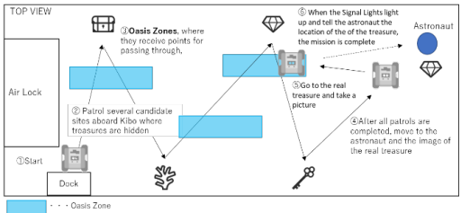
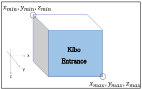
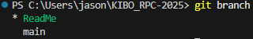

# KIBO_RPC-2025

## KIBO RPC Website

This is where you will login and submit your code into the simulation
[KIBO RPC Website](https://jaxa.krpc.jp)

## Game Flow:

To control NASA's Astrobee in the Preliminary round, please create a program to complete the following game using JAXA's web simulation environment.

### Game Description:

Within a **time limit**, Astrobee will be moved from the **starting position** (_dock station_) to a candidate location in Kibo where the **treasure** is hidden, and all **images** will be read. Astrobee will then be moved to the **astronauts' site**, where it will read the **images of the treasure and landmarks in the astronauts' possession** to provide clues to **locate the real treasure**. After reading the images, the player **moves to the location where the real treasure is hidden, takes a picture of the treasure, flashes the Signal Lights to signal that he/she has found the treasure**, and tells the astronaut where the treasure is hidden to complete the mission.

### Key Takeaway:

1. Start from the Docking Station
2. After starting, Astrobee will patrol each stations (_candidate sites_) where **treasures** are hidden
3. Choose a route through the Oasis Zones, where they receive **bonus points** for passing through, and report what they find at each candidate location for hidden treasures.
4. Once the Astrobee has visited all of the sites, go to the **astronaut and read the image of the real treasure and its nearby landmark**. This will reveal the identity of the real treasure.
5. Go to the **real treasure** and **take a picture**.
6. After taking the photo, activate the **_Signal Lights_** to inform the astronaut of the **treasure's location**, and the mission is complete

**Note** Points will be added **as long as the Astrobee is moving through the Oasis Zone**.

---

### Game Flow Image



---

### Preconditions

| #   | Content                                                                                                                                                                                                                                                                                                                                                                                                                                   |
| --- | ----------------------------------------------------------------------------------------------------------------------------------------------------------------------------------------------------------------------------------------------------------------------------------------------------------------------------------------------------------------------------------------------------------------------------------------- |
| 1   | The starting position is the Dock Station, and the timer starts once Astrobee undocks.                                                                                                                                                                                                                                                                                                                                                    |
| 2   | - There are 11 types of Lost Item images placed in each area. Breakdown: (3 Tresure Items, 8 Landmark Items) <br> - Prepare an AR tag on the same plane as the printed surface of Lost Item. <br> - The search area for Lost Item (hereinafter referred to as "Area") is limited to four locations. <br> - The area is specified as a plane, and one Lost Item is placed somewhere within the Area. <br> - Lost Item placement is random. |
| 3   | The Target Item is randomly selected from one of the Tresure Items in the game.                                                                                                                                                                                                                                                                                                                                                           |
| 4   |

The following information wree presented in issues. For more information on AR tags and Lost Item, please refer to [Scanning AR Tag](https://github.com/oc-robotics/KIBO_RPC-2025/issues/4). <br> <br> 1. Orientation of the position of the starting point <br> 2. Report position to an astronaut <br> 3. Location and size of each area <br> 4. Total number of Areas <br> 5. Types of images to be placed and examples of difficulty levels <br> 6. Location and size of the oasis zones <br> 7. Parameters for a given angle and distance |
| 5 |
Oasis Zones are set up along the route, where points are added according to the time spent in the zone. The oasis zone is given as a precondition. [Detail of Oasis Zone Here](https://github.com/oc-robotics/KIBO_RPC-2025/issues/7)|

**Note** Astrobee does not have to go through the Oasis Zone

---

### Coordinate System



## Github Version Control Conventions

> ![IMPORTANT]
>
> All of the commands in this section should be typed in the terminal

### Pulling Branch

Creating a pull request that will grab the repository from **Github** to **Local**
**Note:** you can exchange main to the branch name you want to pull from

```bash
git pull origin main
```

### Creating Local Branch

Creating a new branch for any new changes

```bash
git checkout -b branch_name
```

### Pushing local changes to Github

Sending your **Local** changes to **Github**

> [!IMPORTANT]
>
> Never push from your local branch into origin main
> It will override the previous code with your branch, which could break somethings

```bash
git add .
git commit -m "Feature message"
git push origin branch_name
```

**Note:** Feature message should clearly indicate what the change does

> Ex: "This change allows the Astrobee to pass through all the Oasis Zones"

### Checking which branch currently on

This commands allows you to check which _branch_ you are currently editing on your **local machine**

```bash
git branch
```

The terminal will output something similar to this:


In this instance the \* <span style="color:green">ReadMe</span> is my current branch
