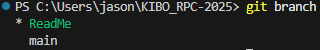

# Git Version Control Instructions

## Github Version Control Conventions

> [!IMPORTANT]
>
> All of the commands in this section should be typed in the terminal

### Pulling Branch

Creating a pull request that will grab the repository from **Github** to **Local**
**Note:** you can exchange main to the branch name you want to pull from

```bash
git pull origin main
```

### Creating Local Branch

Creating a new branch for any new changes

```bash
git checkout -b branch_name
```

### Pushing local changes to Github

Sending your **Local** changes to **Github**

> [!IMPORTANT]
>
> Never push from your local branch into origin main
> It will override the previous code with your branch, which could break somethings

```bash
git add .
git commit -m "Feature message"
git push origin branch_name
```

**Note:** Feature message should clearly indicate what the change does

> Ex: "This change allows the Astrobee to pass through all the Oasis Zones"

### Checking which branch currently on

This commands allows you to check which _branch_ you are currently editing on your **local machine**

```bash
git branch
```

The terminal will output something similar to this:



In this instance the \* ReadMe is my current branch (since the text is green)
