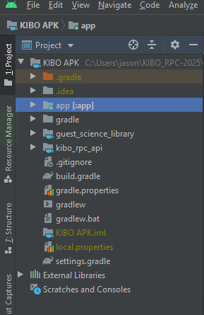
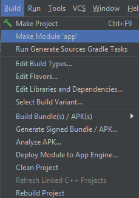

# Program Development

## Building Application

1. Launch the Android Studio
2. Open the folder **KIBO_RPC-2025\KIBO APK\app**

3. Click **app** on the **Project** window

4. Select **Build** --> **Make Module 'app'**


> Note:
You will find the apk file after building it under ```app\build\outputs\apk\debug\app-debug.apk```


