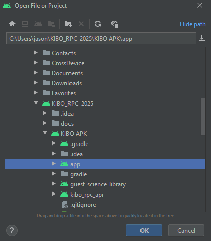
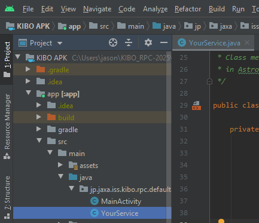
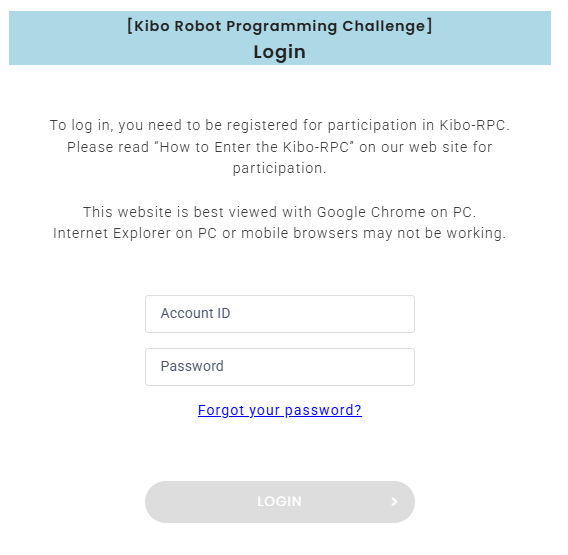
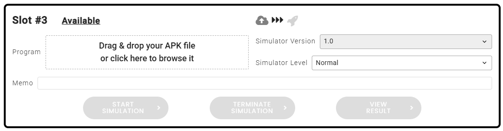
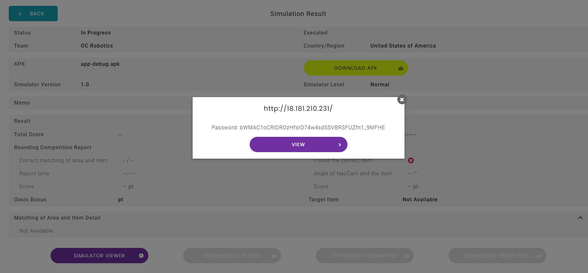

# Program Development

## Building Application

> [!IMPORTANT]
>
> ### For Mac Users
>
> You need to set up the Environment Path to ensure building to be successful
>
> 1. Open Terminal and run command:
>
> ```bash
> echo $ANDROID_SDK_ROOT
> ```
>
> and ensure it outputs the correct path (`/Users/<your_username>/Library/Andrpoid/sdk`)
>
> 2. If it is empty/incorrect, add the variable to your shell configuration file:
>
> ```bash
> export ANDROID_SDK_ROOT=/Users/<your_username>/Library/Android/sdk
> ```

1. Launch the Android Studio
2. Open the folder **KIBO_RPC-2025\KIBO APK\app**



3. Click **app** on the **Project** window


4. Open up the **YourService.java** file



5. Select **Build** --> **Make Module 'app'**


> Note:
> You will find the apk file after building it under `app\build\outputs\apk\debug\app-debug.apk`

## Testing Application

1. Login to [KIBO RPC Website](https://jaxa.krpc.jp/user-auth)

> Note: Login info in Discord Thread **_Simluation Login_**



2. Select Simulation and **Drag-and-Drop** your `apk-debug.apk` file to the box and select Start Simulation

 - Program: The apk file of your code that you want to test - Simulator Version: Version of the current Simulator (can update after preliminary round) - Simulator Level: Difficulty of the simulation
Memo: Comments that you wish to make regarding this test-run of the program

3. Viewing Result of the Test
   1. Click the **Simulation Viewer**
      
   2. Copy the password shown in the popup and paste it when the Simulation Viewer asks for it
